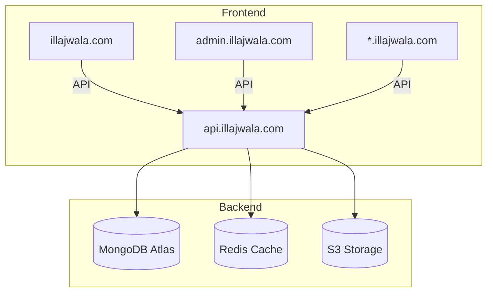

# Illajwala VisitNow Platform – Master PRD & Tech Architecture

## 0. Overview
This document consolidates the **Product Requirements** and **Technical Architecture** for the Illajwala VisitNow multi-tenant appointment booking platform.

- **Vision:** Connect patients and verified healthcare providers for easy discovery, booking, and consultation.
- **Core Domains:** Patient (illajwala.com), Doctor/Clinic (<clinic>.illajwala.com), Admin (admin.illajwala.com)
- **Tech Stack:** Node.js, MongoDB, Next.js, Redis, Docker, CI/CD (GitHub Actions + Vercel + Render)

---

## 1. Product Overview

### Vision & Goals
- Seamless patient-doctor interaction from discovery to follow-up.
- Reliable, scalable SaaS with multi-tenant readiness.
- Compliance-ready (PHI, GDPR-like standards).

### Key Metrics
- Appointment completion rate ≥4★ rating.
- Provider activation & retention.
- Booking API uptime >99.5%.

### Personas
| Persona | App | Goals |
|----------|-----|-------|
| Patient | illajwala.com | Search, book, pay, review |
| Doctor / Clinic | <clinic>.illajwala.com | Manage slots, appointments, staff |
| Admin | admin.illajwala.com | Onboard, verify, manage, monitor |

---

## 2. Architecture Summary

### 2.1 Overall
**Frontend:** 3 Next.js apps
- `apps/patient` → illajwala.com
- `apps/doctor` → *.illajwala.com
- `apps/admin` → admin.illajwala.com

**Backend Services:** Node.js + Express + MongoDB (Atlas)
- `identity-service` (auth, RBAC)
- `provider-service` (doctor profiles)
- `appointment-service` (slots, bookings)
- `payment-service` (Razorpay integration)
- `messaging-service` (email/SMS/WhatsApp)
- `analytics-service` (events & dashboards)

**Infra Components:**
- MongoDB Atlas (data)
- Redis (session cache, slot locks)
- Cloudflare images and R2 (file storage)
- Kafka/NATS (event bus, future use)

**CI/CD:** GitHub Actions → Vercel (Next.js) + Render (services)

---

## 3. Domain Overview

### 3.1 Key Entities (MongoDB)
| Collection | Description |
|-------------|--------------|
| `users` | Patients, doctors, staff, admins |
| `providers` | Doctor profiles, credentials |
| `clinics` | Clinic info, slug (for subdomain) |
| `slots` | Availability slots |
| `appointments` | Booking state machine |
| `payments` | Gateway refs, ledger entries |
| `notifications` | Message templates, delivery logs |

### 3.2 Booking Flow
1. **Doctor onboarded** by admin
2. **Availability published** in Doctor Hub
3. **Patient searches** and books slot
4. **Payment & confirmation** handled by backend
5. **Notifications sent** via messaging-service
6. **Consultation completed**, feedback recorded

---

## 4. Multi-Tenant Setup

### Approach
**Shared DB + tenant isolation** (via `tenantId` or `clinicId` in every collection)

### Subdomain logic
Wildcard DNS:
```
*.illajwala.com -> Vercel
```

In `apps/doctor/middleware.ts`:
```ts
import { NextResponse } from 'next/server';
import type { NextRequest } from 'next/server';

export function middleware(req: NextRequest) {
  const host = req.headers.get('host') || '';
  const subdomain = host.split('.')[0];

  if (subdomain && !['admin', 'illajwala', 'api'].includes(subdomain)) {
    req.nextUrl.searchParams.set('clinic', subdomain);
  }
  return NextResponse.rewrite(req.nextUrl);
}
```

---

## 5. Repo & Folder Structure
```
illajwala/
├─ apps/
│  ├─ patient/           # illajwala.com
│  ├─ doctor/            # *.illajwala.com
│  └─ admin/             # admin.illajwala.com
├─ packages/
│  ├─ ui/                # shared UI components
│  ├─ types/             # TypeScript interfaces
│  ├─ api-client/        # shared API utilities
│  └─ utils/             # helpers
├─ services/
│  ├─ identity-service/
│  ├─ provider-service/
│  ├─ appointment-service/
│  ├─ payment-service/
│  ├─ messaging-service/
│  └─ analytics-service/
├─ infra/
│  ├─ docker-compose.yml
│  ├─ terraform/
│  └─ k8s/
└─ .github/workflows/    # CI/CD
```

---

## 6. Deployment & Hosting

### Frontend
- Hosted on **Vercel** with wildcard subdomain routing.
- Each app (patient, doctor, admin) as separate project.

### Backend
- Hosted on **Render** or **Fly.io**.
- API gateway: `api.illajwala.com`
- Reverse proxy routes:
  - `/auth/*` → identity-service
  - `/providers/*` → provider-service
  - `/appointments/*` → appointment-service

### Infra
| Component | Host |
|------------|------|
| MongoDB | MongoDB Atlas |
| Redis | Upstash / Aiven |
| Storage | S3 / Cloudflare R2 |
| DNS | Cloudflare (wildcard) |
| Logs | Loki / ELK |

---

## 7. Auth & Security
- JWT (access + refresh) per user.
- Roles: `patient`, `doctor`, `staff`, `admin`.
- Tokens contain `tenantId`.
- Staff invites via signed links.
- HTTPS enforced, audit logs, data encryption.

---

## 8. Testing Strategy
| Type | Tools |
|------|-------|
| Unit | Jest / Vitest |
| Integration | Supertest |
| E2E | Playwright / Cypress |
| Contract | PACT / zod schemas |
| Load | k6 |

---

## 9. Delivery Phases (24 Weeks)
| Phase | Weeks | Focus |
|--------|--------|--------|
| 0 | 0-2 | Infra + Auth + CI/CD |
| 1 | 3-6 | Provider Onboarding |
| 2 | 7-10 | Booking + Payments |
| 3 | 11-14 | Consultation + Docs |
| 4 | 15-18 | Ops + Analytics |
| 5 | 19-22 | Scalability + Waitlist |
| 6 | 23-24 | Pilot + Launch |

---

## 10. Immediate Next Steps
1. Initialize monorepo (pnpm / npm workspaces)
2. Setup MongoDB Atlas + Redis (Upstash)
3. Create `identity-service` (Express + Mongoose)
4. Scaffold Next.js apps (patient, doctor, admin)
5. Implement subdomain middleware
6. Integrate Razorpay sandbox
7. Configure CI/CD (GitHub Actions + Vercel + Render)

---

## 11. Future Enhancements
- Mobile apps (React Native)
- AI doctor recommendation engine
- Insurance / EMR integrations
- Advanced telehealth (WebRTC)

---

## 12. Compliance
- Store audit logs immutably
- Retention + deletion policies
- Encrypted backups + DR drills
- Consent management + export/delete APIs

---

## 13. Definition of Done (MVP)
- End-to-end booking flow live in staging
- Security review complete
- Onboarding <48h, booking <5min, NPS ≥4.2
- Pilot clinics active

---

## 14. Diagram Overview (Simplified)


---


